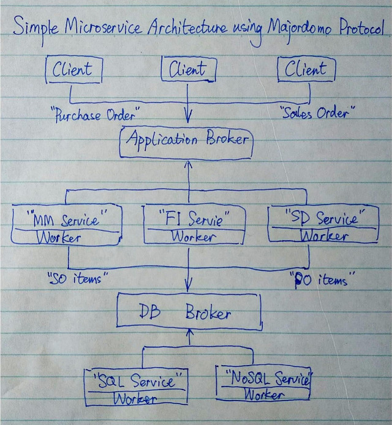

# Simple Microservice Architecture using Majordomo Protocol (SMAMP)

This is a PoC(Prove of Concept) project to show that microservices can be 
achieved using ZeroMQ's Majordomo Pattern.

## Background Knowledge about the Majordomo Pattern of ZeroMQ

Before starting to introduce Majordomo Pattern, let's see what ZeroMQ can do.

ZeroMQ is a messaging library, which allows you to design a complex communication system 
without much effort.

It has the following features:

  - Connect your code in any language, on any platform
  - Carries messages across inproc, IPC, TCP, TIPC, multicast
  - Smart patterns like pub-sub, push-pull, and router-dealer
  - High-speed asynchronous I/O engines, in a tiny library
  - Backed by a large and active open source community
  - Supports every modern language and platform
  - Build any architecture: centralized, distributed, small, or large

Some well-known companies are using ZeroMQ, for example, AT&T, Cisco, EA, NASA, 
Samsung Electronics, Microsoft.

### *Majordomo Pattern - Service-Oriented Reliable Queuing*

Majordomo involves 3 parts, a client, a broker and a worker. It is a 
Service-Oriented Reliable Queuing protocol. It adds a "service name" to
requests that the client sends, and asks workers to register for specific
services. The broker, as its name implies, takes requests from clients and
forwards the requests to the respective workers with specific "service name". 

### *Titanic Pattern - Disconnected Reliability*

Majordomo is a "reliable" message broker, but in reality, for all the
enterprise messaging systems, persistence is a 'must' feature. However,
performance drops a lot due to this persistence feature, it should be
acknowledged accordingly.

Titanic Pattern can be treated as Majordomo Pattern with persistence. 
The office ZeroMQ guide only includes a Titanic Pattern example for ZeroMQ 3.x,
which is obsolete. Here in this PoC project, I implemented Titanic Pattern
based on ZeroMQ 4.x version.

## SMAMP

SMAMP uses 2 brokers. One of them forwards the clients' requests to application
workers, and the other connects to the both application workers and DB workers.
In SMAMP, the application broker acts as an ***application layer*** which dispatches the
specific requests to the respective workers which provide specific microservices.
The DB broker acts as an ***infrastructure layer*** which replays the requests from
the microservices to SQL or NoSQL workers.

SMAMP aims to align with the **Domain-Driven Design** principle. In this PoC project,
I use a "MM service" to simulate some functions in the Material Management Module
of the ERP software. I use MongoDB as the database server which is connected to
the "NoSQL service" worker. Inside the "MM service", the **CRUD** operations of
MongoDB are implemented.

### *Feature Extending*

It is quite flexible to add more features to SMAMP.

  - Apply Titanic Pattern to microservices or DB services or to both.
  - Add Redis as cache to microservices or DB services or to both.

### *Performance Turning*

To improve performance of microservices, Redis server can be added as the cache.
For DB services, Redis server can also be applied to improve **read** performace.

If Titanic Pattern is used in SMAMP. Pieter Hintjens gave the following
suggestions,

>>*If you want to use Titanic in real cases, you'll rapidly be asking
"how do we make this faster?"*

>>*Here's what I'd do, starting with the example implementation:*

>>  - Use a single disk file for all data, rather than multiple files. Operating systems are usually better at handling a few large files than many smaller ones.
>>  - Organize that disk file as a circular buffer so that new requests can be written contiguously (with very occasional wraparound). One thread, writing full speed to a disk file, can work rapidly.
>>  - Keep the index in memory and rebuild the index at startup time, from the disk buffer. This saves the extra disk head flutter needed to keep the index fully safe on disk. You would want an fsync after every message, or every N milliseconds if you were prepared to lose the last M messages in case of a system failure.
>>  - Use a solid-state drive rather than spinning iron oxide platters.
>>  - Pre-allocate the entire file, or allocate it in large chunks, which allows the circular buffer to grow and shrink as needed. This avoids fragmentation and ensures that most reads and writes are contiguous.

>>*And so on. What I'd not recommend is storing messages in a database,
not even a "fast" key/value store, unless you really like a specific database
and don't have performance worries. You will pay a steep price for the
abstraction, ten to a thousand times over a raw disk file.*

>>*If you want to make Titanic even more reliable, duplicate the requests to
a second server, which you'd place in a second location just far away enough
to survive a nuclear attack on your primary location, yet not so far that you
 get too much latency.*

>>*If you want to make Titanic much faster and less reliable, store requests
and replies purely in memory. This will give you the functionality of a
disconnected network, but requests won't survive a crash of the Titanic
server itself.*

Apart from what Pieter suggested, optimising the code to manipulate linux 
Page Cache can also be considered to improve the IO performace. This technique
is already used in Apache Kafka.

